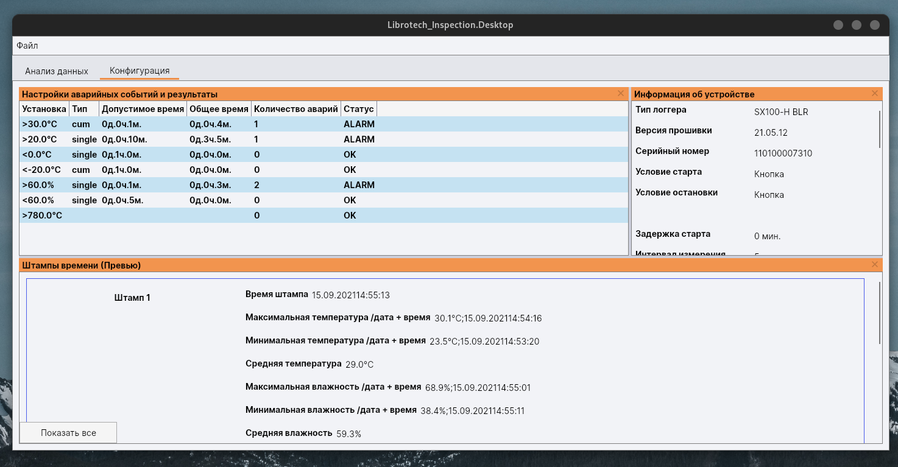

# Librotech Inspection

Librotech Inspection it is an application for analyzing 
the data collected by the Librotech [data logger](https://en.wikipedia.org/wiki/Data_logger).
The application is being developed for Windows, Linux and MacOS

At the moment, only russian language is available in the application.

    
    

